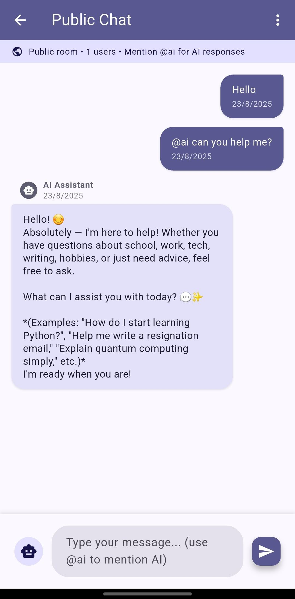
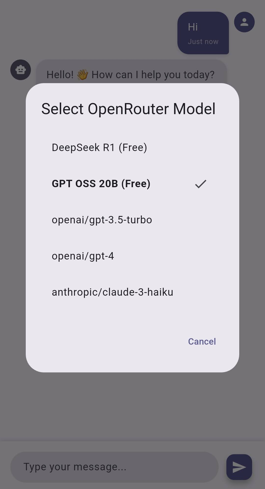

# NeoChat 🚀

**NeoChat** is an AI-powered chat application built with Flutter that combines real-time messaging with intelligent AI conversations. Experience the future of communication with seamless integration of multiple AI models and modern chat features.


## 📸 Screenshots

<p align="center">
  
  
  
</p>

## ✨ Features

### Core Features
- **User Authentication** - Secure Firebase Auth with email/password and Google Sign-In
- **AI Chat Interface** - Modern chat UI with AI conversation support
- **Real-time Messaging** - Firebase Firestore integration with message persistence
- **Group Chat Rooms** - Multi-user chat rooms with real-time synchronization
- **Multi-Model AI Support** - Integration with OpenRouter, OpenAI, and Anthropic APIs
- **Cross-platform Support** - Works seamlessly on iOS, Android, Web, and Desktop

### Technical Features
- **Material Design 3** - Modern UI with light/dark theme support
- **Responsive Design** - Optimized for all screen sizes
- **Real-time Synchronization** - Instant message delivery and chat history
- **Secure Data Storage** - Firebase Firestore with comprehensive security rules
- **State Management** - Efficient Provider pattern implementation
- **Offline Support** - Message caching and synchronization

## 🚀 Getting Started

### Prerequisites
- Flutter SDK (>=3.8.1)
- Dart SDK
- Android Studio / VS Code
- Firebase account
- OpenRouter/OpenAI API key (for AI features)

### Installation

1. **Clone the repository**
   ```bash
   git clone https://github.com/Rahat-Kabir/neo-chat.git
   cd neo-chat/neo_chat
   ```

2. **Install dependencies**
   ```bash
   flutter pub get
   ```

3. **Configure Firebase**
   - Follow the instructions in [FIREBASE_SETUP.md](FIREBASE_SETUP.md)
   - Copy `lib/firebase_options.dart.template` to `lib/firebase_options.dart`
   - Update with your Firebase configuration

4. **Configure API Keys**
   ```bash
   # Windows
   setup_api_config.bat

   # Linux/Mac
   chmod +x setup_api_config.sh
   ./setup_api_config.sh
   ```
   - Edit `lib/config/api_config.dart` and add your API keys
   - **Never commit API keys to version control**

5. **Deploy Firestore Security Rules**
   ```bash
   firebase deploy --only firestore:rules
   ```

6. **Run the application**
   ```bash
   # Web
   flutter run -d chrome

   # Android
   flutter run -d android

   # iOS
   flutter run -d ios

   # Desktop (Windows/macOS/Linux)
   flutter run -d windows
   ```

## 🏗️ Project Structure

```
neo-chat/
├── neo_chat/                # Flutter application
│   ├── lib/
│   │   ├── main.dart        # App entry point
│   │   ├── config/          # API and app configuration
│   │   ├── models/          # Data models
│   │   ├── providers/       # State management
│   │   ├── screens/         # UI screens
│   │   ├── services/        # Business logic & APIs
│   │   └── widgets/         # Reusable UI components
│   └── pubspec.yaml         # Dependencies
├── FIREBASE_SETUP.md        # Firebase configuration guide
├── firestore.rules          # Firestore security rules
├── LICENSE                  # MIT License
└── README.md               # This file
```

## 🤖 AI Integration

NeoChat supports multiple AI providers:

- **OpenRouter** - Access to DeepSeek R1 and other open-source models
- **OpenAI** - GPT-3.5 Turbo and GPT-4 support
- **Anthropic** - Claude models integration

### Features
- Context-aware conversations
- Real-time streaming responses
- Multi-model selection
- Conversation history persistence

## 🔐 Security & Privacy

- **Secure Authentication** - Firebase Authentication with email/password and OAuth
- **Data Encryption** - All communications use HTTPS
- **Firestore Security Rules** - User data isolation and access control
- **API Key Management** - Template-based secure configuration
- **Privacy Protection** - Individual user data isolation

## 📱 Supported Platforms

- ✅ **Android** - Fully tested and supported
- ✅ **iOS** - Full support with native features
- ✅ **Web** - Progressive Web App capabilities
- ✅ **Windows** - Desktop application support
- ✅ **macOS** - Native desktop experience
- ✅ **Linux** - Desktop support

## 🤝 Contributing

Contributions are welcome! Please follow these steps:

1. Fork the repository
2. Create a feature branch (`git checkout -b feature/amazing-feature`)
3. Commit your changes (`git commit -m 'Add amazing feature'`)
4. Push to the branch (`git push origin feature/amazing-feature`)
5. Open a Pull Request

### Development Guidelines
- Follow Flutter best practices
- Write clean, documented code
- Test on multiple platforms
- Never commit sensitive credentials
- Update documentation for new features

## 📄 License

This project is licensed under the MIT License - see the [LICENSE](LICENSE) file for details.

## 👨‍💻 Author

**Rahat Kabir**
- GitHub: [@Rahat-Kabir](https://github.com/Rahat-Kabir)
- Email: rahatkabir0101@gmail.com

## 🙏 Acknowledgments

- Flutter team for the amazing framework
- Firebase for backend infrastructure
- OpenRouter, OpenAI, and Anthropic for AI capabilities
- The open-source community

---

**NeoChat** - Where AI meets conversation 💬✨
